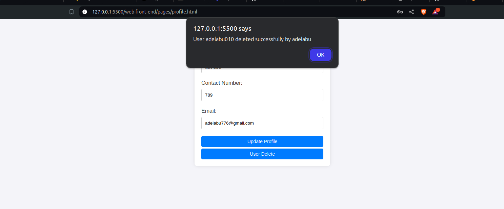
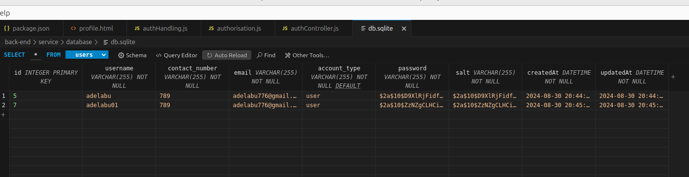

<h1 align="center">Authentication and Authorisation with Expressjs</h1>

---

 This a StackUp Bounty Project on Authentication and Authorisation with Expressjs Project.
      

## 📝 Table of Contents

- [Challenge Part 2](./back-end/README.md)
- [Getting Started](#getting_started)
- [Prerequisites](#prerequisites)
- [The Delete User Functionality](#delete)
- [Authors](#authors)
- [Acknowledgments](#acknowledgement)

## 🏁 Getting Started 

These instructions will get you a copy of the project up and running on your local machine for development and testing purposes. See [deployment](#deployment) for notes on how to deploy the project on a live system.

## Prerequisites 

What things you need to install the software and how to install them.

<h3>
1. Set Up Node.js Environment:

Verify Installation: Check if Node.js is installed by running node -v in your terminal.
Install Missing Node.js: If not installed, download and install Node.js from https://nodejs.org/en/download/package-manager.
</h3>
<h3>
2. Navigate to Project Directory:

Open Terminal: Open your terminal or command prompt.
Change Directory: Use the cd command to navigate to the "backend" folder of your project.
</h3>
<h3>
3. Install Project Dependencies:

Open Terminal: Ensure you're in the "backend" directory.
Install Packages: Run npm install to install the required dependencies listed in your package.json file.
Start Server: Once the installation is complete, run npm start to start the backend server.
<h3>
4. Configure Code Editor:

Install Extensions: Open your code editor and install the following extensions:
SQLite3 Editor: For managing SQLite3 databases.
Live Server: For previewing HTML files in a local web server.
<h3>
5. Open HTML File:

Locate File: Navigate to the "web-front-end/pages" directory and open the "index.html" file.
Start Live Server: Right-click on the "index.html" file and select the "Open with Live Server" option (or use a keyboard shortcut if available). This will launch a local web server and open the file in your default browser.

## Delete User 

The functionality added to this project

## ✍️ Authors 

- [@adelabu](https://github.com/adelabu001)

## 🎉 Acknowledgements 

- [Stackup](https://stackup.dev/)
