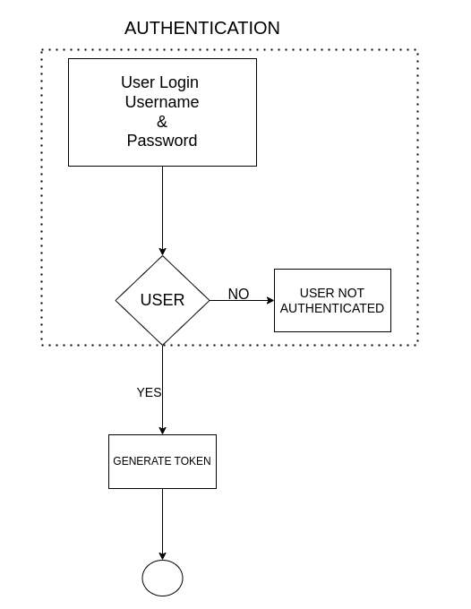
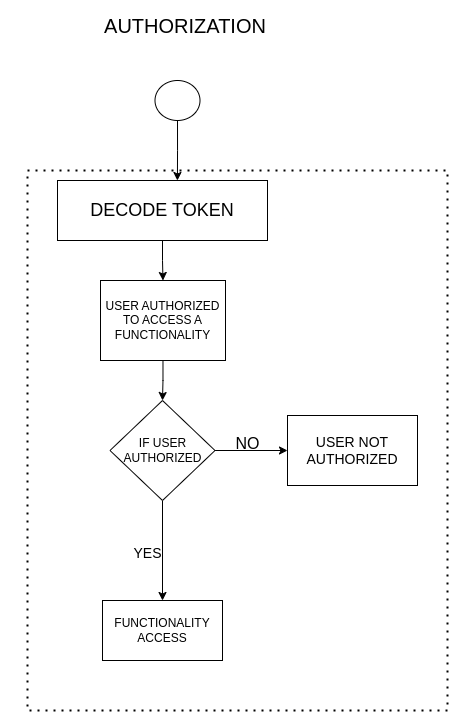

<h1 align="center">Authentication and Authorisation with Expressjs</h1>

<div align="center">

[]()
[](https://github.com/alibaba0010/authentication-and-authorisation-with-expressjs/issues)
[](https://github.com/kylelobo/The-Documentation-Compendium/pulls)
[](/LICENSE)

</div>

<h3 align="center">Is it a good idea to require authentication before allowing users to delete other users?</h3>

```
The requirement to implement authentication before allowing users to delete other users is a very good idea.


1. Prevention of Unauthorized Access: Without authentication, anyone could potentially delete any user account, leading to data loss and security breaches.

2. Maintenance of Data Integrity: Ensuring that only authenticated and authorized individuals can delete user accounts helps protect the integrity of the system's data.

3. Enforcement of Policies: Authentication allows you to enforce specific policies and restrictions regarding who can delete users, such as requiring admin privileges or specific roles.

```

<h3 align="center"> Fundamental concepts of Authentication and Authorisation</h3>

```
Authentication and authorization are two fundamental concepts in security that are often used interchangeably but have distinct meanings.
```

### Authentication

```
Authentication is the process of verifying a user's identity. It involves confirming that the user is who they claim to be. This can be achieved through various methods like passwords, biometrics, or tokens and in this project password was used.
```

### Authorization

```
Authorization is the process of determining what a user is permitted to do once their identity has been verified (authenticated). It involves granting or denying access to specific resources or actions based on the user's roles, permissions, or privileges.
```

### Why is Authentication Necessary and also a good Idea for Deleting Users in this project?

```
- Prevent Unauthorized Access: Without authentication, anyone could potentially delete any user account, leading to data loss and security breaches.

- Maintain Data Integrity: Ensuring that only authenticated individuals (and they are also authorized) can delete user accounts helps protect the integrity of the system's data.

- Accountability: Authentication provides a way to track who deleted a user account, which can be important for auditing and legal purposes.

- User Experience: Requiring authentication for user deletion can improve the overall user experience by providing a sense of security and control over their data
```

### Conclusion

```
The requirement to implement authentication before deleting users is a crucial security measure. It helps prevent unauthorized access to sensitive data and ensures that only authorized individuals can perform actions that could have significant consequences.

Authentication and authorization are complementary concepts. Authentication verifies the user's identity, while authorization determines what the user is allowed to do. Both are essential for building secure and robust systems.

```


